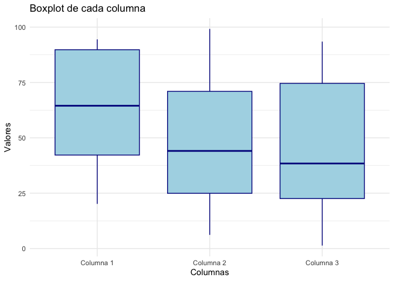

<!-- README.md is generated from README.Rmd. Please edit that file -->

# BioMetrix

<!-- badges: start -->
<!-- badges: end -->

The goal of `BioMetrix` is to calculate mean and standard desviation by
columns and generate boxplots…

## Installation instructions

Get the latest stable `R` release from
[CRAN](http://cran.r-project.org/). Then install `BioMetrix` from
[Bioconductor](http://bioconductor.org/) using the following code:

``` r
if (!requireNamespace("BiocManager", quietly = TRUE)) {
    install.packages("BiocManager")
}

BiocManager::install("BioMetrix")
```

## Example

This is a basic example which shows you how to solve a common problem:

``` r
library("BioMetrix")
## basic example code
```

You can load this example data:

``` r
set.seed(0)
matrix <- round(matrix(runif(30, min = 0, max = 100), nrow = 10, ncol = 3), 2)
```

You can also generate boxplots, for example:

    #> No id variables; using all as measure variables



## Citation

Below is the citation output from using `citation('BioMetrix')` in R.
Please run this yourself to check for any updates on how to cite
**BioMetrix**.

``` r
print(citation('BioMetrix'), bibtex = TRUE)
#> To cite package 'BioMetrix' in publications use:
#> 
#>   Dabiguina94 (2024). _BioMetrix_. doi:10.18129/B9.bioc.BioMetrix
#>   <https://doi.org/10.18129/B9.bioc.BioMetrix>,
#>   https://github.com/Dabiguina94/BioMetrix/BioMetrix - R package
#>   version 0.99.0, <http://www.bioconductor.org/packages/BioMetrix>.
#> 
#> A BibTeX entry for LaTeX users is
#> 
#>   @Manual{,
#>     title = {BioMetrix},
#>     author = {{Dabiguina94}},
#>     year = {2024},
#>     url = {http://www.bioconductor.org/packages/BioMetrix},
#>     note = {https://github.com/Dabiguina94/BioMetrix/BioMetrix - R package version 0.99.0},
#>     doi = {10.18129/B9.bioc.BioMetrix},
#>   }
#> 
#>   Dabiguina94 (2024). "BioMetrix." _bioRxiv_. doi:10.1101/TODO
#>   <https://doi.org/10.1101/TODO>,
#>   <https://www.biorxiv.org/content/10.1101/TODO>.
#> 
#> A BibTeX entry for LaTeX users is
#> 
#>   @Article{,
#>     title = {BioMetrix},
#>     author = {{Dabiguina94}},
#>     year = {2024},
#>     journal = {bioRxiv},
#>     doi = {10.1101/TODO},
#>     url = {https://www.biorxiv.org/content/10.1101/TODO},
#>   }
```

Please note that the `BioMetrix` was only made possible thanks to many
other R and bioinformatics software authors, which are cited either in
the vignettes and/or the paper(s) describing this package.

## Code of Conduct

Please note that the `BioMetrix` project is released with a [Contributor
Code of Conduct](http://bioconductor.org/about/code-of-conduct/). By
contributing to this project, you agree to abide by its terms.

## Development tools

- Continuous code testing is possible thanks to [GitHub
  actions](https://www.tidyverse.org/blog/2020/04/usethis-1-6-0/)
  through *[usethis](https://CRAN.R-project.org/package=usethis)*,
  *[remotes](https://CRAN.R-project.org/package=remotes)*, and
  *[rcmdcheck](https://CRAN.R-project.org/package=rcmdcheck)* customized
  to use [Bioconductor’s docker
  containers](https://www.bioconductor.org/help/docker/) and
  *[BiocCheck](https://bioconductor.org/packages/3.17/BiocCheck)*.
- Code coverage assessment is possible thanks to
  [codecov](https://codecov.io/gh) and
  *[covr](https://CRAN.R-project.org/package=covr)*.
- The code is styled automatically thanks to
  *[styler](https://CRAN.R-project.org/package=styler)*.
- The documentation is formatted thanks to
  *[devtools](https://CRAN.R-project.org/package=devtools)* and
  *[roxygen2](https://CRAN.R-project.org/package=roxygen2)*.

For more details, check the `dev` directory.

This package was developed using
*[biocthis](https://bioconductor.org/packages/3.17/biocthis)*.
